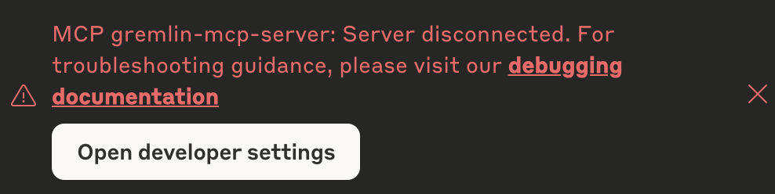

# Gremlin MCP Service

A Model Context Protocol (MCP) service for interacting with Gremlin's reliability management APIs.

## Overview

This MCP service provides access to Gremlin's reliability testing and management capabilities, including:
- Service reliability management and monitoring
- Service dependency tracking
- Reliability experiments and testing
- Reliability reporting

## Installation

### Prerequisites
- Node.js 22 or higher
- npm
- make
- Valid Gremlin API credentials

### Setup

1. Clone the repository:
```bash
git clone git@github.com:gremlin/mcp.git gremlin-mcp
cd gremlin-mcp
```

2. Install dependencies:
```bash
make install
```

3. Build the service:
```bash
make
```

4. Configure your MCP Client!

#### Claude Desktop Configuration

To use this MCP service with Claude Desktop, go to Claude Settings > Developer to add the following to your `claude_desktop_config.json`:

```json
{
  "mcpServers": {
    "gremlin-mcp": {
      "command": "node",
      "args": ["/path/to/gremlin-mcp/build/main.mjs"],
      "env": {
        "GREMLIN_API_KEY": "your_gremlin_api_key_here"
      }
    }
  }
}
```

**Note:** Replace `/path/to/gremlin-mcp` with the actual path to your service directory.

## Available Tools

### Service Management

#### `list_services`
Lists all available reliability management (RM) services with their descriptions, scores, and targeting information.

#### `get_service_dependencies`
Retrieves dependencies for a specific service.
- **Parameters:** `teamId` (required), `serviceId` (required)

#### `get_service_status_checks`
Gets status checks configured for a service.
- **Parameters:** `teamId` (required), `serviceId` (required)

#### `list_service_risks`
Lists identified risks associated with a service.
- **Parameters:** `teamId` (required), `serviceId` (required)

### Reliability Reports & Analytics

#### `get_reliability_report`
Generates a reliability report for a service on a specific date.
- **Parameters:** `teamId` (required), `serviceId` (required), `date` (optional, defaults to today, format: YYYY-MM-DD)

#### `get_reliability_experiments`
Retrieves recent reliability experiments for a service.
- **Parameters:** `teamId` (required), `serviceId` (required), `dependencyId` (optional), `testId` (optional), `limit` (optional, default: 100)

### Testing & Experiments

#### `get_recent_reliability_tests`
Gets recent reliability tests for a team.
- **Parameters:** `teamId` (required), `pageSize` (optional, default: 5), `pageToken` (optional)

#### `get_current_test_suite`
Retrieves the current test suite for a team or all teams.
- **Parameters:** `teamId` (optional)

## Usage Notes

- All date parameters should use YYYY-MM-DD format
- Team and service IDs are required for most service-specific operations
- Optional parameters have sensible defaults where applicable


## Example Queries

Here are some example queries you can use with Claude when this MCP service is configured:

1. **List all services:**
> "What reliability management services are available?"

2. **Identify Critical Dependency for Coverage:**
> "I'm trying to find which are my most critical dependencies.  Can you pull all my RM services, identify shared dependencies, ignoring ignored dependencies, create a list of them and then use the policy reports to understand what my coverage currently is for these dependencies.  Finally; I want you to create a quick page with some graphics to help me understand the state of the world"

3. **Identify gaps in Scheduling:**
> I think my schedule for tests is misconfigured for my RM services.  I think this because I'm seeing a lot of expired policy evaluations in my RM Reports.  It takes about 6 weeks to expire a policy evaluation and I should be testing every week.  Now given my scheduling window it's possible that I'm not running every test every week, but across 6 weeks it seems less likely.  Now, it's expected that for policy evaluations on a dependency which is marked as a SPOF it's expected for the policy evaluation to get to EXPIRED state.  So can you go check all my RM services and figure out how many policy evaluations (excluding those on ignored or SPOF dependencies) are expired as a percentage of total? I'd like to see that on a per service basis


## Troubleshooting

### Common Issues

1. **Authentication Errors**
   - Ensure your `GREMLIN_API_KEY` is valid and has the necessary permissions

2. **Service Disconnected**
   - Verify the service is properly built (`make build`)
   - Check the path in `claude_desktop_config.json` points to the correct location
   - Ensure correct version of Node.js is in your system PATH
   - Check claude's logs (eg. `less ~/Library/Logs/Claude/mcp-server-gremlin-mcp-server.log`, but deployment specific)


3. **Missing Dependencies**
   - Run `make install` to ensure all dependencies are installed
   - Check that you're using Node.js version 22 or higher
   - You may have more than one version of NODE on your path so you may want to override your PATH like

```
{
  "mcpServers": {
    "gremlin-mcp": {
      "command": "node",
      "args": ["/path/to/gremlin-mcp/build/main.mjs"],
      "env": {
        "GREMLIN_API_KEY": "your_gremlin_api_key_here",
        "PATH": "/path/to/node/bin:/usr/local/bin:/usr/bin:/bin"
      }
    }
  }
}
```

### Debug Mode

For debugging you can use the inspector like:

```bash
make inspector
```

## Support

For issues or questions, please [create an issue](https://support-site.gremlin.com/support/tickets/new) or contact support.
